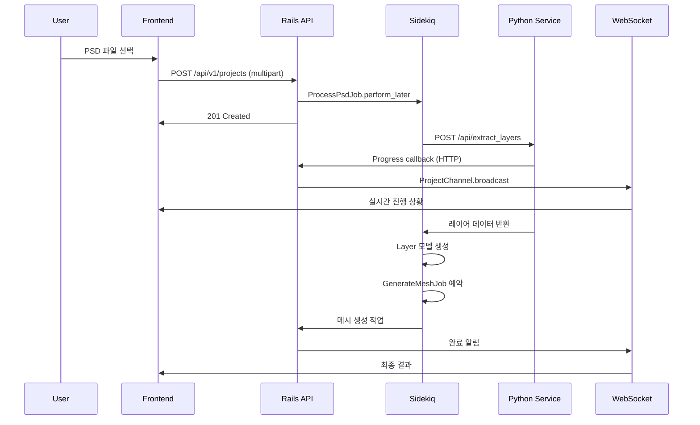
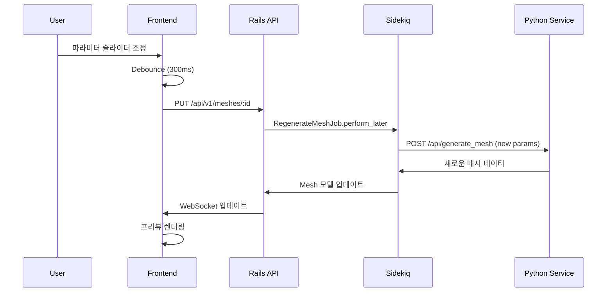

# SpineLift Rails - 컴포넌트 구조도

**작성일**: 2025년 1월 9일  
**프로젝트**: SpineLift Rails v1.0-alpha  

## 전체 시스템 컴포넌트 맵

```mermaid
graph TB
    subgraph "Frontend Layer (React/TypeScript)"
        subgraph "Pages"
            A1[LoginPage]
            A2[RegisterPage] 
            A3[DashboardPage]
            A4[ProjectDetailPage]
        end
        
        subgraph "Components"
            B1[FileUpload]
            B2[ProcessingStatus]
            B3[LayerList]
            B4[MeshPreview]
            B5[ProjectList]
            B6[ParameterPanel]
        end
        
        subgraph "Services"
            C1[ApiClient]
            C2[AuthService]
            C3[WebSocketService]
            C4[FileService]
        end
        
        subgraph "State Management"
            D1[AuthStore]
            D2[ProjectStore]
            D3[UIStore]
        end
    end
    
    subgraph "Rails API Layer"
        subgraph "Controllers"
            E1[AuthController]
            E2[ProjectsController]
            E3[LayersController]
            E4[MeshesController]
        end
        
        subgraph "Models"
            F1[User]
            F2[Project]
            F3[Layer]
            F4[Mesh]
            F5[ProcessingLog]
        end
        
        subgraph "Services"
            G1[PsdProcessingService]
            G2[MeshGenerationService]
            G3[WebSocketBroadcastService]
            G4[FileUploadService]
        end
        
        subgraph "Jobs"
            H1[ProcessPsdJob]
            H2[GenerateMeshJob]
            H3[RegenerateMeshJob]
        end
        
        subgraph "Channels"
            I1[ProjectChannel]
            I2[ApplicationCable]
        end
    end
    
    subgraph "Python Service Layer"
        subgraph "API Endpoints"
            J1[/api/extract_layers]
            J2[/api/generate_mesh]
            J3[/api/health]
        end
        
        subgraph "Core Services"
            K1[PSDExtractor]
            K2[MeshGenerator]
            K3[ImageProcessor]
            K4[CallbackService]
        end
        
        subgraph "Utils"
            L1[TriangulationEngine]
            L2[ImageUtils]
            L3[MeshOptimizer]
        end
    end
    
    subgraph "Data Layer"
        M1[(PostgreSQL)]
        M2[(Redis)]
        M3[(S3 Storage)]
    end
```

## 프론트엔드 컴포넌트 상세 분석

### 페이지 컴포넌트 (Routes)

#### 1. LoginPage (/login)
**파일**: `frontend/src/pages/LoginPage.tsx`
```typescript
interface LoginPageProps {}

// 기능:
// - 사용자 인증 폼
// - JWT 토큰 발급 및 저장
// - 리다이렉션 처리
```

**의존성**:
- AuthService (로그인 API 호출)
- AuthStore (인증 상태 관리)
- LoginForm 컴포넌트

#### 2. ProjectDetailPage (/projects/:id)
**파일**: `frontend/src/pages/ProjectDetailPage.tsx`
```typescript
interface ProjectDetailPageProps {
  projectId: string;
}

// 기능:
// - 프로젝트 상세 정보 표시
// - 레이어 목록 및 메시 프리뷰
// - 실시간 처리 상태 업데이트
// - 파라미터 조정 UI (부분 구현)
```

**의존성**:
- ProjectStore (프로젝트 데이터)
- WebSocketService (실시간 업데이트)
- ProcessingStatus, LayerList, MeshPreview

### 재사용 가능한 컴포넌트

#### 1. FileUpload 컴포넌트
**파일**: `frontend/src/components/FileUpload.tsx`
```typescript
interface FileUploadProps {
  onFileSelect: (file: File) => void;
  acceptedTypes: string[];
  maxSize: number;
  loading?: boolean;
}

// 기능:
// - 드래그 앤 드롭 파일 업로드
// - 파일 타입 및 크기 검증
// - 업로드 진행률 표시
// - 에러 메시지 표시
```

**현재 상태**: ✅ 완전 구현됨
**사용 위치**: ProjectDetailPage, DashboardPage

#### 2. ProcessingStatus 컴포넌트
**파일**: `frontend/src/components/ProcessingStatus.tsx`
```typescript
interface ProcessingStatusProps {
  projectId: string;
  status: ProcessingStatus;
  progress: number;
  logs: ProcessingLog[];
}

// 기능:
// - 실시간 처리 진행률 표시
// - 단계별 처리 상태 시각화
// - 에러 메시지 및 로그 표시
// - WebSocket 연결 상태 표시
```

**현재 상태**: ✅ 완전 구현됨
**WebSocket 연동**: ProjectChannel을 통한 실시간 업데이트

#### 3. MeshPreview 컴포넌트 🚧
**파일**: `frontend/src/components/MeshPreview.tsx`
```typescript
interface MeshPreviewProps {
  meshData: MeshData;
  renderMode: 'wireframe' | 'solid' | 'textured';
  interactive: boolean;
}

// 현재 기능:
// - Canvas 기반 기본 렌더링
// - 메시 데이터 시각화

// 필요한 개선사항:
// - WebGL/PIXI.js 통합
// - 버텍스 직접 조작
// - 줌/팬 기능
// - 성능 최적화
```

**현재 상태**: 🚧 부분 구현됨 (기본 Canvas만)
**향후 계획**: PIXI.js로 완전 재작성 필요

#### 4. ParameterPanel 컴포넌트 ❌
**예정 파일**: `frontend/src/components/ParameterPanel.tsx`
```typescript
interface ParameterPanelProps {
  parameters: MeshParameters;
  onParameterChange: (params: Partial<MeshParameters>) => void;
  disabled?: boolean;
}

// 구현 필요 기능:
// - 7개 메시 파라미터 슬라이더
// - 실시간 디바운싱
// - 프리셋 저장/로드
// - 리셋 기능
```

**현재 상태**: ❌ 미구현
**우선순위**: 높음 (로드맵 Phase 1.1)

### 서비스 레이어 (Frontend)

#### 1. ApiClient
**파일**: `frontend/src/services/ApiClient.ts`
```typescript
class ApiClient {
  private baseURL: string;
  private token: string | null;
  
  // 메서드:
  // - get(), post(), put(), delete()
  // - setAuthToken()
  // - interceptors (요청/응답 가로채기)
  // - 에러 핸들링
}
```

**기능**:
- Axios 기반 HTTP 클라이언트
- JWT 토큰 자동 첨부
- 응답 에러 중앙 처리
- API 엔드포인트 추상화

#### 2. WebSocketService
**파일**: `frontend/src/services/WebSocketService.ts`
```typescript
class WebSocketService {
  private cable: ActionCable.Cable;
  private subscriptions: Map<string, ActionCable.Channel>;
  
  // 메서드:
  // - connect()
  // - subscribe(channel, callbacks)
  // - unsubscribe(channel)
  // - disconnect()
}
```

**기능**:
- ActionCable 클라이언트 관리
- 채널별 구독 관리
- 자동 재연결
- 메시지 타입별 콜백

### 상태 관리 (Zustand Stores)

#### 1. AuthStore
**파일**: `frontend/src/stores/authStore.ts`
```typescript
interface AuthState {
  user: User | null;
  token: string | null;
  loading: boolean;
  error: string | null;
  
  // Actions
  login: (credentials) => Promise<void>;
  logout: () => void;
  refreshToken: () => Promise<void>;
  clearError: () => void;
}
```

#### 2. ProjectStore
**파일**: `frontend/src/stores/projectStore.ts`
```typescript
interface ProjectState {
  projects: Project[];
  currentProject: Project | null;
  layers: Layer[];
  loading: boolean;
  
  // Actions
  fetchProjects: () => Promise<void>;
  createProject: (data) => Promise<void>;
  updateProject: (id, data) => Promise<void>;
  setCurrentProject: (project) => void;
}
```

## 백엔드 컴포넌트 상세 분석

### Rails 컨트롤러 레이어

#### 1. ProjectsController
**파일**: `app/controllers/api/v1/projects_controller.rb`
```ruby
class Api::V1::ProjectsController < ApplicationController
  before_action :authenticate_user!
  before_action :set_project, only: [:show, :update, :destroy]
  
  # Endpoints:
  # GET /api/v1/projects
  # POST /api/v1/projects
  # GET /api/v1/projects/:id
  # PUT /api/v1/projects/:id
  # DELETE /api/v1/projects/:id
  # GET /api/v1/projects/:id/processing_status
  # POST /api/v1/projects/:id/cancel_processing
end
```

**기능**:
- RESTful CRUD 작업
- 파일 업로드 처리
- 처리 상태 조회
- 백그라운드 작업 트리거

#### 2. MeshesController
**파일**: `app/controllers/api/v1/meshes_controller.rb`
```ruby
class Api::V1::MeshesController < ApplicationController
  # Endpoints:
  # GET /api/v1/layers/:layer_id/meshes
  # POST /api/v1/layers/:layer_id/meshes
  # PUT /api/v1/meshes/:id
  # POST /api/v1/meshes/:id/regenerate
end
```

**기능**:
- 메시 CRUD 작업
- 파라미터 기반 메시 재생성
- 메시 품질 분석

### Rails 모델 레이어

#### 1. Project 모델
**파일**: `app/models/project.rb`
```ruby
class Project < ApplicationRecord
  belongs_to :user
  has_many :layers, dependent: :destroy
  has_many :processing_logs, dependent: :destroy
  has_one_attached :psd_file
  
  # Enums
  enum :status, {
    pending: 'pending',
    processing: 'processing', 
    completed: 'completed',
    failed: 'failed'
  }
  
  # Methods
  def processing_progress
  def cancel_processing!
  def layer_count
end
```

#### 2. Layer 모델
**파일**: `app/models/layer.rb`
```ruby
class Layer < ApplicationRecord
  belongs_to :project
  has_one :mesh, dependent: :destroy
  has_one_attached :image
  
  # JSON 속성
  store_accessor :metadata, :bounds, :opacity, :blend_mode
  store_accessor :position_data, :x, :y, :width, :height
  
  # Methods
  def mesh_generated?
  def processing_complete?
end
```

### Rails 서비스 레이어

#### 1. PsdProcessingService
**파일**: `app/services/psd_processing_service.rb`
```ruby
class PsdProcessingService
  def initialize(project)
    @project = project
    @python_service_url = ENV.fetch('PYTHON_SERVICE_URL')
  end
  
  def call
    # 1. PSD 파일을 Python 서비스로 전송
    # 2. 레이어 추출 요청
    # 3. 진행 상황 콜백 처리
    # 4. 결과를 데이터베이스에 저장
  end
  
  private
  
  def send_to_python_service
  def handle_callback
  def create_layers_from_response
end
```

#### 2. MeshGenerationService
**파일**: `app/services/mesh_generation_service.rb`
```ruby
class MeshGenerationService
  def initialize(layer, parameters = {})
    @layer = layer
    @parameters = default_parameters.merge(parameters)
  end
  
  def call
    # 1. 레이어 이미지를 Python 서비스로 전송
    # 2. 메시 생성 요청 (파라미터 포함)
    # 3. 생성된 메시 데이터를 저장
    # 4. WebSocket으로 결과 브로드캐스트
  end
  
  private
  
  def default_parameters
    {
      max_vertices: 1000,
      quality: 0.8,
      simplification: 0.1,
      boundary_accuracy: 0.95,
      interior_accuracy: 0.85,
      smoothing: 0.3,
      edge_threshold: 50
    }
  end
end
```

### Rails 백그라운드 잡

#### 1. ProcessPsdJob
**파일**: `app/jobs/process_psd_job.rb`
```ruby
class ProcessPsdJob < ApplicationJob
  queue_as :default
  retry_on StandardError, wait: :exponentially_longer, attempts: 3
  
  def perform(project_id)
    project = Project.find(project_id)
    
    # 상태 업데이트
    project.update!(status: :processing)
    
    # PSD 처리 서비스 호출
    result = PsdProcessingService.new(project).call
    
    if result.success?
      project.update!(status: :completed)
      # 각 레이어에 대해 메시 생성 작업 예약
      project.layers.each do |layer|
        GenerateMeshJob.perform_later(layer.id)
      end
    else
      project.update!(status: :failed)
    end
    
    # WebSocket 브로드캐스트
    ProjectChannel.broadcast_to(project, {
      type: 'status_update',
      status: project.status
    })
  end
end
```

#### 2. GenerateMeshJob
**파일**: `app/jobs/generate_mesh_job.rb`
```ruby
class GenerateMeshJob < ApplicationJob
  queue_as :default
  
  def perform(layer_id, parameters = {})
    layer = Layer.find(layer_id)
    
    result = MeshGenerationService.new(layer, parameters).call
    
    if result.success?
      layer.update!(status: :completed)
    else
      layer.update!(status: :failed)
    end
    
    # 실시간 업데이트
    ProjectChannel.broadcast_to(layer.project, {
      type: 'mesh_generated',
      layer_id: layer.id,
      mesh_data: layer.mesh&.as_json
    })
  end
end
```

### ActionCable 채널

#### 1. ProjectChannel
**파일**: `app/channels/project_channel.rb`
```ruby
class ProjectChannel < ApplicationCable::Channel
  def subscribed
    project = Project.find(params[:project_id])
    stream_for project if authorized_for_project?(project)
  end
  
  def unsubscribed
    # 정리 작업
  end
  
  private
  
  def authorized_for_project?(project)
    project.user == current_user
  end
end
```

## Python 서비스 컴포넌트

### FastAPI 엔드포인트

#### 1. Layer Extraction Endpoint
**파일**: `python_service/main.py`
```python
@app.post("/api/extract_layers")
async def extract_layers(
    file: UploadFile = File(...),
    callback_url: str = Form(...),
    project_id: str = Form(...)
):
    # 1. PSD 파일 검증
    # 2. psd-tools로 레이어 추출
    # 3. 각 레이어를 PNG로 변환
    # 4. 진행 상황을 콜백으로 전송
    # 5. 결과 반환
```

#### 2. Mesh Generation Endpoint
**파일**: `python_service/main.py`
```python
@app.post("/api/generate_mesh")
async def generate_mesh(request: MeshGenerationRequest):
    # 1. 이미지 다운로드
    # 2. 알파 채널 기반 경계 검출
    # 3. Delaunay 삼각분할
    # 4. 메시 최적화
    # 5. 결과 반환
```

### 핵심 서비스 클래스

#### 1. PSDExtractor
**파일**: `python_service/services/psd_extractor.py`
```python
class PSDExtractor:
    def __init__(self, psd_file_path: str):
        self.psd_file_path = psd_file_path
        self.psd = None
    
    async def extract_layers(self) -> List[LayerData]:
        # psd-tools를 사용한 레이어 추출
        # 메타데이터 수집
        # PNG 변환
```

#### 2. MeshGenerator
**파일**: `python_service/services/mesh_generator.py`
```python
class MeshGenerator:
    def __init__(self, parameters: MeshParameters):
        self.parameters = parameters
        self.triangulator = TriangulationEngine()
    
    async def generate_from_image(self, image_url: str) -> MeshData:
        # 이미지 전처리
        # 경계점 추출
        # 삼각분할 실행
        # 최적화 적용
```

## 데이터 흐름 다이어그램

### 1. PSD 업로드 및 처리 흐름



### 2. 메시 파라미터 조정 흐름



## 성능 고려사항 및 최적화 포인트

### 프론트엔드 최적화
1. **컴포넌트 메모이제이션**: React.memo, useMemo 활용
2. **Virtual Scrolling**: 대량 레이어 목록 처리
3. **WebGL 렌더링**: Canvas 대신 PIXI.js 사용
4. **이미지 Lazy Loading**: 메시 프리뷰 성능 향상

### 백엔드 최적화  
1. **N+1 쿼리 방지**: includes, preload 활용
2. **데이터베이스 인덱싱**: 자주 쿼리되는 컬럼
3. **Redis 캐싱**: API 응답, 세션 데이터
4. **백그라운드 작업 최적화**: 큐 우선순위, 배치 처리

### Python 서비스 최적화
1. **메모리 관리**: 대용량 PSD 처리 시 청크 단위
2. **병렬 처리**: 다중 레이어 동시 처리
3. **캐싱**: 중간 처리 결과 임시 저장
4. **알고리즘 최적화**: 더 효율적인 삼각분할

## 결론

SpineLift Rails의 컴포넌트 구조는 **모듈화와 관심사 분리**가 잘 이루어진 현대적인 아키텍처를 보여줍니다. 각 레이어가 명확한 책임을 가지고 있으며, **실시간 통신**과 **비동기 처리**가 효과적으로 구현되어 있습니다.

주요 완성도는 **백엔드 70%**, **프론트엔드 60%**, **Python 서비스 80%** 수준이며, 다음 단계에서는 **WebGL 메시 에디터**와 **파라미터 조정 UI** 구현이 핵심입니다.