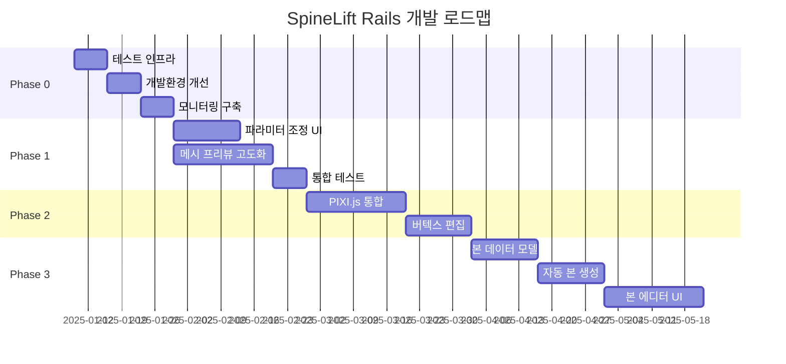

# SpineLift Rails - 초기 로드맵

**작성일**: 2025년 1월 9일  
**프로젝트**: SpineLift Rails v1.0-alpha  
**목표**: 현재 상태 기반 실행 가능한 로드맵  

## 현재 상태 요약

### ✅ 구현 완료 (70%)
- **사용자 인증 시스템**: Devise + JWT 완전 구현
- **PSD 처리 파이프라인**: Python 서비스 연동 완료
- **메시 생성 엔진**: Delaunay 삼각분할 구현
- **실시간 통신**: ActionCable WebSocket 완료  
- **백그라운드 작업**: Sidekiq 기반 비동기 처리
- **기본 API**: RESTful 엔드포인트 완료

### 🚧 부분 구현 (20%)
- **메시 프리뷰**: Canvas 기본 렌더링만 존재
- **파라미터 조정**: 백엔드 준비, 프론트엔드 미구현
- **에러 처리**: 기본 구조만 존재

### ❌ 미구현 (10%)
- **WebGL 메시 에디터**: PIXI.js 통합 필요
- **본 시스템**: 데이터 모델부터 완전 부재
- **Spine 익스포트**: 익스포트 기능 전무
- **테스트 시스템**: 테스트 코드 전혀 없음

## Phase별 우선순위 재정의

기존 로드맵 문서의 Phase를 현재 상태에 맞게 재조정하였습니다.

### Phase 0: 기반 안정화 (2-3주) - **즉시 실행**
현재 구현된 기능의 안정성과 사용성을 확보하는 단계

#### 0.1 테스트 인프라 구축 (1주)
```
우선순위: 매우 높음
복잡도: 중간
의존성: 없음
```

**목표**: 현재 코드에 대한 기본 테스트 커버리지 확보

**작업 목록**:
- [ ] RSpec 설정 및 기본 테스트 환경 구축
- [ ] Model 테스트: User, Project, Layer, Mesh
- [ ] Controller 테스트: 기본 API 엔드포인트
- [ ] Service 테스트: PsdProcessingService, MeshGenerationService
- [ ] Job 테스트: ProcessPsdJob, GenerateMeshJob
- [ ] Frontend 테스트: Jest + Testing Library 설정

**성공 지표**:
- 핵심 기능 80% 테스트 커버리지
- CI/CD 파이프라인에서 자동 테스트 실행
- 버그 발견 및 수정 프로세스 구축

#### 0.2 개발 환경 개선 (1주)
```
우선순위: 높음
복잡도: 낮음  
의존성: 테스트 인프라
```

**작업 목록**:
- [ ] README.md 작성 (설치, 실행, 개발 가이드)
- [ ] API 문서 자동 생성 (Swagger/OpenAPI)
- [ ] 개발 데이터 시드 개선
- [ ] Docker 개발 환경 최적화
- [ ] 로깅 시스템 구조화

**성공 지표**:
- 신규 개발자가 30분 내 로컬 환경 구축
- API 문서 자동 업데이트
- 구조화된 로그로 디버깅 효율성 향상

#### 0.3 성능 모니터링 기반 구축 (1주)
```
우선순위: 중간
복잡도: 중간
의존성: 없음
```

**작업 목록**:
- [ ] 기본 APM 도구 통합 (New Relic 또는 Scout)
- [ ] 에러 추적 시스템 (Sentry)
- [ ] 성능 지표 대시보드
- [ ] 알림 시스템 구축

### Phase 1: 사용자 경험 개선 (4-5주)
현재 기능을 사용자가 실제로 활용할 수 있는 수준으로 발전

#### 1.1 메시 파라미터 실시간 조정 UI (2-3주)
```
우선순위: 매우 높음
복잡도: 중간
의존성: Phase 0 완료
```

**현재 상태**: 백엔드 API는 준비됨, 프론트엔드 UI만 구현 필요

**작업 목록**:
- [ ] ParameterPanel 컴포넌트 설계 및 구현
  ```typescript
  interface ParameterPanelProps {
    meshId: string;
    initialParameters: MeshParameters;
    onParameterChange: (params: MeshParameters) => void;
    disabled?: boolean;
  }
  ```
- [ ] 7개 파라미터 슬라이더 UI (Tailwind CSS)
  - Max Vertices (100-5000)
  - Quality (0.1-1.0)
  - Simplification (0.0-0.5)  
  - Boundary Accuracy (0.5-1.0)
  - Interior Accuracy (0.5-1.0)
  - Smoothing (0.0-1.0)
  - Edge Threshold (10-200)
- [ ] 실시간 디바운싱 (300ms) 및 API 호출
- [ ] 파라미터 프리셋 시스템 (저장/로드)
- [ ] 파라미터 변경 히스토리 (언두/리두)

**기술 스택**:
- React 슬라이더 컴포넌트 (react-range 또는 custom)
- Lodash debounce 함수
- Zustand 상태 관리
- 기존 WebSocket 채널 활용

**성공 지표**:
- 모든 파라미터 실시간 조정 가능
- 300ms 이내 서버 요청 디바운싱
- 메시 재생성 시간 5초 이내 (1000 vertices)
- 파라미터 프리셋 저장/로드 완료

#### 1.2 메시 프리뷰 시스템 고도화 (2-3주)
```
우선순위: 높음
복잡도: 높음
의존성: 1.1 진행 중 병렬 작업 가능
```

**현재 상태**: 기본 Canvas 렌더링만 존재

**작업 목록**:
- [ ] Canvas 렌더링 개선
  ```typescript
  interface MeshPreviewProps {
    meshData: MeshData;
    renderMode: 'wireframe' | 'solid' | 'textured';
    interactive: boolean;
    showVertices?: boolean;
    showEdges?: boolean;
  }
  ```
- [ ] 뷰포트 조작 기능
  - 마우스 휠 줌 (0.1x - 5.0x)
  - 드래그 팬
  - 더블클릭 fit-to-view
  - 키보드 단축키 (R: 리셋, F: 전체보기)
- [ ] 렌더링 모드 전환
  - Wireframe: 삼각형 경계선만
  - Solid: 단색 채움
  - Textured: 원본 이미지 텍스처
- [ ] 메시 정보 오버레이
  - Vertex 개수, Triangle 개수
  - 메시 품질 점수
  - 처리 시간

**성능 목표**:
- 1000+ vertices에서 부드러운 60fps 유지
- 실시간 파라미터 변경 시 렌더링 지연 최소화
- 메모리 사용량 최적화

**향후 WebGL 전환 준비**:
현재는 Canvas로 구현하되, 컴포넌트 인터페이스를 WebGL 전환 시 호환되도록 설계

### Phase 2: WebGL 기반 고급 에디터 (5-6주)
사용자가 직접 메시를 편집할 수 있는 전문적인 도구로 발전

#### 2.1 PIXI.js 통합 및 WebGL 렌더러 (3주)
```
우선순위: 높음
복잡도: 매우 높음
의존성: Phase 1 완료
```

**작업 목록**:
- [ ] PIXI.js 7.4+ 설치 및 기본 설정
- [ ] WebGL 렌더러 구현
  ```typescript
  class WebGLMeshRenderer {
    private app: PIXI.Application;
    private meshContainer: PIXI.Container;
    private vertexGraphics: PIXI.Graphics[];
    
    constructor(canvas: HTMLCanvasElement) {
      this.app = new PIXI.Application({
        view: canvas,
        antialias: true,
        transparent: true,
        resolution: window.devicePixelRatio || 1,
      });
    }
    
    renderMesh(meshData: MeshData): void;
    updateVertexPositions(vertices: Vertex[]): void;
    setRenderMode(mode: RenderMode): void;
  }
  ```
- [ ] 고성능 메시 렌더링 시스템
- [ ] 메모리 풀링 및 오브젝트 재사용
- [ ] GPU 기반 렌더링 최적화

#### 2.2 버텍스 직접 조작 시스템 (2-3주)
```
우선순위: 중간
복잡도: 높음
의존성: 2.1 완료
```

**작업 목록**:
- [ ] 버텍스 선택 시스템
  - 클릭/드래그 선택
  - 박스 선택 (Shift+드래그)
  - 다중 선택 (Ctrl+클릭)
- [ ] 드래그 앤 드롭 편집
  - 버텍스 위치 실시간 변경
  - 스냅 기능 (그리드, 다른 버텍스)
  - 제약 조건 (경계 내부만 이동)
- [ ] 편집 도구
  - 버텍스 추가/삭제
  - 엣지 분할
  - 삼각형 플립
- [ ] 언두/리두 시스템 (20단계 히스토리)

**사용자 경험 목표**:
- 버텍스 조작 시 실시간 피드백 (60fps)
- 직관적인 마우스/키보드 인터페이스
- 전문 3D 소프트웨어 수준의 조작감

### Phase 3: 본 시스템 기반 구축 (6-7주)
Spine 애니메이션의 핵심인 본 시스템 완전 구현

#### 3.1 본 데이터 모델 설계 (2주)
```
우선순위: 중간
복잡도: 높음  
의존성: Phase 2 완료
```

**데이터베이스 마이그레이션**:
```ruby
# 본 기본 정보
create_table :bones do |t|
  t.references :project, null: false, foreign_key: true
  t.references :parent_bone, foreign_key: { to_table: :bones }
  t.string :name, null: false
  t.decimal :x, precision: 10, scale: 3, default: 0
  t.decimal :y, precision: 10, scale: 3, default: 0
  t.decimal :rotation, precision: 8, scale: 3, default: 0
  t.decimal :length, precision: 8, scale: 3, default: 100
  t.decimal :scale_x, precision: 5, scale: 3, default: 1
  t.decimal :scale_y, precision: 5, scale: 3, default: 1
  t.integer :draw_order, default: 0
  t.timestamps
end

# 버텍스-본 웨이트
create_table :bone_weights do |t|
  t.references :bone, null: false, foreign_key: true
  t.references :vertex, null: false, foreign_key: true
  t.decimal :weight, precision: 5, scale: 3, null: false
  t.timestamps
end

# 버텍스 정보 확장
add_column :vertices, :mesh_id, :bigint
add_column :vertices, :x, :decimal, precision: 10, scale: 3
add_column :vertices, :y, :decimal, precision: 10, scale: 3
add_column :vertices, :u, :decimal, precision: 8, scale: 6  
add_column :vertices, :v, :decimal, precision: 8, scale: 6
```

**모델 구현**:
```ruby
class Bone < ApplicationRecord
  belongs_to :project
  belongs_to :parent_bone, class_name: 'Bone', optional: true
  has_many :child_bones, class_name: 'Bone', foreign_key: 'parent_bone_id'
  has_many :bone_weights, dependent: :destroy
  has_many :vertices, through: :bone_weights
  
  # 본 계층 구조 관리
  def root?
  def leaf?
  def siblings
  def depth
  def world_transform
end
```

#### 3.2 자동 본 생성 알고리즘 (2주)
```
우선순위: 중간
복잡도: 매우 높음
의존성: 3.1 완료
```

**알고리즘 설계**:
- 스켈레톤 추출: 이미지의 중심선 추출
- 관절점 검출: 분기점 및 끝점 찾기  
- 본 구조 생성: 계층 관계 자동 설정
- Weight 자동 계산: 거리 기반 가중치 할당

#### 3.3 본 에디터 UI (2-3주)
```
우선순위: 낮음
복잡도: 높음
의존성: 3.2 완료  
```

**UI 컴포넌트**:
- BoneHierarchy: 트리 구조 표시
- BoneEditor: 캔버스 기반 본 편집
- WeightPainter: 브러시 기반 weight 편집
- BoneProperties: 본 속성 패널

### Phase 4: Spine 익스포트 시스템 (4-5주)
완전한 Spine 호환 파일 생성

#### 4.1 Spine JSON 익스포트 엔진 (3주)
```
우선순위: 낮음
복잡도: 높음
의존성: Phase 3 완료
```

**Spine JSON 구조 구현**:
```json
{
  "skeleton": {
    "spine": "3.8.95",
    "width": 1024,
    "height": 1024,
    "images": "./images/",
    "audio": ""
  },
  "bones": [
    {
      "name": "root"
    },
    {
      "name": "body", 
      "parent": "root",
      "length": 100.5,
      "x": 0, "y": 0,
      "rotation": 0,
      "scaleX": 1, "scaleY": 1
    }
  ],
  "slots": [...],
  "skins": {
    "default": {
      "body": {
        "mesh": {
          "type": "mesh",
          "uvs": [...],
          "triangles": [...],
          "vertices": [...],
          "hull": 4
        }
      }
    }
  }
}
```

#### 4.2 텍스처 아틀라스 생성 (2주)
```
우선순위: 낮음
복잡도: 중간
의존성: 4.1 진행 중 병렬 작업
```

**아틀라스 패킹 알고리즘**:
- Bin packing: 2D rectangle packing
- 효율성 최적화: 80% 이상 공간 활용
- 크기 제한: 2048x2048 최대 크기
- 다운로드 패키지: ZIP 파일 생성

## 리소스 및 일정 계획

### 개발 리소스 요구사항

#### Phase 0 (2-3주)
- **풀스택 개발자**: 1명
- **시간**: 주당 40시간
- **총 공수**: 80-120시간

#### Phase 1 (4-5주)  
- **풀스택 개발자**: 1-2명
- **프론트엔드 전문가**: 0.5명 (WebGL 경험 필요)
- **시간**: 주당 60-80시간
- **총 공수**: 240-400시간

#### Phase 2 (5-6주)
- **프론트엔드 전문가**: 1명 (WebGL/PIXI.js 필수)
- **풀스택 개발자**: 0.5명 (백엔드 지원)
- **시간**: 주당 60시간  
- **총 공수**: 300-360시간

### 기술 스택 확장 계획

#### 새로 도입할 라이브러리
```json
{
  "frontend": {
    "pixi.js": "^7.4.0",
    "react-range": "^1.8.14", 
    "@testing-library/react": "^13.4.0",
    "jest": "^29.7.0"
  },
  "backend": {
    "rspec-rails": "^6.0.0",
    "factory_bot_rails": "^6.2.0",
    "scout_apm": "^5.3.0",
    "sentry-ruby": "^5.15.0"
  },
  "python": {
    "pytest": "^7.4.0",
    "scipy": "^1.11.0",
    "networkx": "^3.2.0"
  }
}
```

#### 인프라 확장
- **모니터링**: New Relic APM, Sentry 에러 추적
- **CI/CD**: GitHub Actions 기반 자동화
- **성능**: CDN 구축, 캐싱 레이어 추가

## 위험 요소 및 대응 전략

### 높은 위험도 요소

#### 1. WebGL 호환성 문제
- **위험도**: 높음
- **영향**: 일부 구형 브라우저/디바이스에서 동작 불가
- **대응책**: 
  - Canvas fallback 구현
  - WebGL 지원 검사 및 안내
  - 최소 요구사항 명시

#### 2. 성능 병목 (복잡한 메시)
- **위험도**: 중간  
- **영향**: 대용량 PSD 파일에서 성능 저하
- **대응책**:
  - 점진적 렌더링 (LOD 시스템)
  - 메모리 사용량 모니터링
  - 사용자 설정 가능한 품질 옵션

#### 3. PIXI.js 학습 곡선
- **위험도**: 중간
- **영향**: 개발 일정 지연 가능성
- **대응책**:
  - Phase 1에서 Canvas 구현 후 Phase 2에서 전환
  - PIXI.js 전문가 컨설팅 고려
  - 충분한 프로토타이핑 기간 확보

### 일정 지연 대응 전략

#### Phase별 최소 성공 기준 설정
- **Phase 0**: 테스트 커버리지 50% 이상 확보
- **Phase 1**: 파라미터 조정 기능 완전 구현 
- **Phase 2**: WebGL 렌더링만 구현 (편집 기능 후순위)
- **Phase 3-4**: MVP에서 제외 가능한 추가 기능

#### 조기 사용자 피드백
- Phase 1 완료 후 베타 테스트 실시
- 사용자 피드백을 통한 우선순위 조정
- 핵심 사용자 워크플로우 집중

## 성공 지표 (KPI) 설정

### 기술적 KPI

#### Phase 0 완료 시점
- [ ] 핵심 기능 테스트 커버리지 80% 이상
- [ ] CI/CD 파이프라인 100% 자동화
- [ ] 개발 환경 구축 시간 30분 이내
- [ ] API 문서 자동 생성 및 실시간 업데이트

#### Phase 1 완료 시점  
- [ ] 파라미터 변경 후 메시 재생성 5초 이내
- [ ] 실시간 디바운싱 300ms 정확도
- [ ] 메시 프리뷰 60fps 안정성
- [ ] 사용자 워크플로우 완성도 90%

#### Phase 2 완료 시점
- [ ] WebGL 렌더링 성능 기존 대비 300% 향상
- [ ] 1000+ 버텍스에서 60fps 유지
- [ ] 메모리 사용량 500MB 이하
- [ ] 버텍스 편집 지연시간 100ms 이내

### 사용자 경험 KPI

#### 정량적 지표
- **첫 메시 생성 시간**: 기존 60초 → 목표 30초
- **파라미터 조정 반응성**: 목표 300ms 이내
- **에러율**: 사용자 액션 대비 1% 미만
- **완료율**: PSD 업로드부터 메시 생성까지 95% 이상

#### 정성적 지표  
- **학습 용이성**: 신규 사용자 30분 내 첫 메시 생성
- **직관성**: 메시 편집 기능 설명 없이 사용 가능
- **만족도**: 베타 테스터 피드백 4.0/5.0 이상

## 로드맵 실행 전략

### Agile 개발 프로세스
- **Sprint 길이**: 2주
- **데모**: Sprint 종료 시 결과물 시연
- **회고**: 매 Sprint 후 프로세스 개선
- **일일 스탠드업**: 진행 상황 및 블로커 공유

### Phase별 마일스톤


### 커뮤니케이션 계획
- **주간 리포트**: 진행 상황 및 다음 주 계획
- **월간 데모**: 이해관계자 대상 진행 상황 공유  
- **분기별 로드맵 리뷰**: 우선순위 재조정 및 목표 업데이트

## 결론

이 로드맵은 SpineLift Rails의 **현재 구현 상태를 정확히 반영**하여 **실행 가능한 계획**을 수립했습니다. 

### 핵심 전략
1. **점진적 개선**: 현재 작동하는 기능부터 사용자 경험 향상
2. **사용자 가치 우선**: 파라미터 조정과 메시 프리뷰 기능 우선 개발
3. **기술적 안정성**: 테스트와 모니터링 기반 구축을 선행
4. **위험 관리**: 각 Phase별 최소 성공 기준과 fallback 옵션 준비

### 기대 효과
- **Phase 0 완료 시**: 프로덕션 배포 가능한 안정성 확보
- **Phase 1 완료 시**: 실제 사용 가능한 PSD-to-메시 도구 완성
- **Phase 2 완료 시**: 전문적인 메시 편집 도구로 발전
- **전체 완료 시**: Spine 생태계에서 경쟁력 있는 제품으로 자리매김

다음 단계는 **Phase 0**부터 즉시 실행하여 견고한 기반을 구축하는 것이 중요합니다.