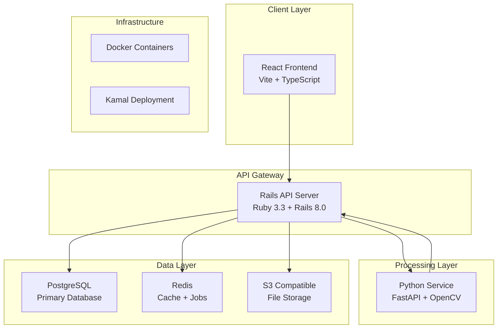

# SpineLift Rails - 기술 스택 분석

**분석일**: 2025년 1월 9일  
**프로젝트**: SpineLift Rails v1.0-alpha  

## 전체 아키텍처 개요

SpineLift는 **마이크로서비스 아키텍처**를 기반으로 한 현대적인 웹 애플리케이션입니다. 각 서비스는 명확한 책임 분리와 독립적인 배포가 가능하도록 설계되었습니다.



## 백엔드 기술 스택

### Rails API 서버 (Ruby 3.3.7)

#### 코어 프레임워크
- **Ruby on Rails**: 8.0.2 (최신 버전, API 모드)
- **Ruby 버전**: 3.3.7
- **API 모드**: JSON API 전용, 뷰 렌더링 없음
- **설정**: 최소한의 미들웨어로 성능 최적화

#### 데이터베이스 & ORM
- **Primary DB**: PostgreSQL (JSONB 지원)
- **ORM**: Active Record 8.0
- **Migration**: Rails migration 시스템
- **JSON Storage**: JSONB 컬럼으로 복잡한 메시 데이터 저장

#### 인증 & 보안
- **Authentication**: Devise 4.9.3
- **Authorization**: JWT 토큰 기반
- **CORS**: rack-cors gem으로 크로스 오리진 설정
- **Password**: bcrypt 암호화

#### 백그라운드 작업
- **Job Processor**: Sidekiq 7.1.1
- **Queue Adapter**: Active Job with Sidekiq
- **Redis**: 작업 큐 및 세션 스토리지
- **Retry Logic**: 3회 재시도, 지수 백오프

#### 실시간 통신
- **WebSocket**: Action Cable (Rails 내장)
- **Transport**: WebSocket over HTTP/HTTPS
- **Channel**: Project별 개별 채널 구독
- **Adapter**: Redis를 통한 멀티 서버 지원

#### API 직렬화
- **Serializer**: JSONAPI::Serializer
- **Format**: JSON:API 규격 준수
- **Relations**: 효율적인 include 관계 처리
- **Caching**: 미구현 (향후 추가 필요)

#### 파일 처리
- **Storage**: Active Storage
- **Adapter**: S3 호환 스토리지 (개발: local)
- **Upload**: Multipart form 지원
- **Validation**: 파일 타입, 크기 제한

### Python 마이크로서비스 (Python 3.11)

#### 웹 프레임워크
- **FastAPI**: 0.104.1 (현대적 비동기 API)
- **ASGI Server**: Uvicorn (고성능 비동기 서버)
- **Async/Await**: 완전한 비동기 처리
- **Type Hints**: Pydantic 모델 기반 타입 안전성

#### 이미지 처리 라이브러리
- **OpenCV**: 4.8.1 (컴퓨터 비전)
- **PIL/Pillow**: 10.0.1 (이미지 조작)
- **psd-tools**: 1.9.31 (PSD 파일 파싱)
- **NumPy**: 1.24.3 (수치 연산)

#### 메시 생성 엔진
- **Triangle**: 20220202 (Delaunay 삼각분할)
- **Matplotlib**: 시각화 (개발/디버그용)
- **SciPy**: 고급 수학적 알고리즘 (향후 확장)

#### HTTP 클라이언트
- **httpx**: 0.25.0 (비동기 HTTP 클라이언트)
- **Callbacks**: Rails로 진행 상황 전송
- **Retry**: 네트워크 오류 시 재시도

## 프론트엔드 기술 스택

### React 애플리케이션 (Node.js 20+)

#### 코어 프레임워크
- **React**: 19.1.1 (최신 안정 버전)
- **TypeScript**: 5.7.3 (완전한 타입 안전성)
- **Build Tool**: Vite 7.1.0 (빠른 빌드 및 HMR)
- **Package Manager**: npm/yarn

#### 상태 관리
- **Global State**: Zustand 5.0.4 (경량 상태 관리)
- **Server State**: React Query/TanStack Query (서버 데이터)
- **Local State**: React useState/useReducer
- **Persistence**: localStorage 기반 토큰 저장

#### HTTP & 통신
- **HTTP Client**: Axios 1.7.8
- **WebSocket**: @rails/actioncable 8.0.1
- **API Layer**: Custom API client with interceptors
- **Error Handling**: 중앙집중식 에러 관리

#### UI & 스타일링
- **CSS Framework**: Tailwind CSS 4.1.11
- **Icon Library**: Lucide React 0.469.0
- **Components**: Custom 컴포넌트 (UI 라이브러리 미사용)
- **Responsive**: Mobile-first 반응형 디자인

#### 개발 도구
- **Linting**: ESLint 9.17.0
- **Type Checking**: TypeScript compiler
- **Hot Reload**: Vite HMR
- **Dev Server**: Vite dev server

## 데이터베이스 설계

### PostgreSQL 스키마

#### 핵심 테이블 구조
```sql
-- 사용자 관리
users (
  id uuid PRIMARY KEY,
  email varchar UNIQUE NOT NULL,
  name varchar,
  encrypted_password varchar NOT NULL,
  created_at timestamp,
  updated_at timestamp
);

-- 프로젝트 (PSD 파일 단위)
projects (
  id uuid PRIMARY KEY,
  user_id uuid REFERENCES users(id),
  name varchar NOT NULL,
  status varchar DEFAULT 'pending',
  processing_metadata jsonb,
  created_at timestamp,
  updated_at timestamp
);

-- PSD 레이어
layers (
  id uuid PRIMARY KEY,
  project_id uuid REFERENCES projects(id),
  name varchar NOT NULL,
  layer_type varchar,
  position_data jsonb,
  status varchar DEFAULT 'pending',
  metadata jsonb,
  created_at timestamp,
  updated_at timestamp
);

-- 생성된 메시
meshes (
  id uuid PRIMARY KEY,
  layer_id uuid REFERENCES layers(id),
  vertices jsonb NOT NULL,
  triangles jsonb NOT NULL,
  parameters jsonb,
  quality_score decimal,
  created_at timestamp,
  updated_at timestamp
);

-- 처리 로그
processing_logs (
  id uuid PRIMARY KEY,
  project_id uuid REFERENCES projects(id),
  step_name varchar NOT NULL,
  status varchar NOT NULL,
  details jsonb,
  timestamp timestamp DEFAULT NOW()
);
```

#### 인덱싱 전략
```sql
-- 성능 최적화 인덱스
CREATE INDEX idx_projects_user_id ON projects(user_id);
CREATE INDEX idx_layers_project_id ON layers(project_id);
CREATE INDEX idx_meshes_layer_id ON meshes(layer_id);
CREATE INDEX idx_processing_logs_project_id ON processing_logs(project_id);
CREATE INDEX idx_projects_status ON projects(status);
CREATE INDEX idx_layers_status ON layers(status);
```

### Redis 설계

#### 데이터 구조
- **Job Queue**: Sidekiq 작업 큐 관리
- **Session Store**: 사용자 세션 정보
- **WebSocket**: Action Cable 구독 정보
- **Cache**: API 응답 캐시 (향후 구현)

#### 키 네임스페이싱
```redis
# Sidekiq 큐
queue:default
queue:critical
queue:low

# WebSocket 채널
cable:Z2lkOi8vc3BpbmVsaWZ0X3JhaWxz...

# 세션 (향후)
session:user:${user_id}

# 캐시 (향후)
cache:project:${project_id}
cache:mesh:${mesh_id}
```

## 배포 및 인프라

### 컨테이너화 (Docker)

#### Multi-stage 빌드 구조
```dockerfile
# Rails Dockerfile
FROM ruby:3.3.7-alpine AS base
FROM base AS development
FROM base AS production

# Python Service Dockerfile  
FROM python:3.11-slim AS base
FROM base AS development
FROM base AS production

# Frontend Build
FROM node:20-alpine AS build
FROM nginx:alpine AS serve
```

#### 서비스 구성 (docker-compose)
```yaml
services:
  rails:
    build: .
    ports: ["3000:3000"]
    depends_on: [postgres, redis]
    
  python_service:
    build: ./python_service
    ports: ["8001:8000"]
    
  sidekiq:
    build: .
    command: bundle exec sidekiq
    depends_on: [redis, postgres]
    
  postgres:
    image: postgres:16
    
  redis:
    image: redis:7-alpine
```

### 배포 도구 (Kamal)

#### 설정 구조
- **config/deploy.yml**: 메인 배포 설정
- **환경별 설정**: staging, production 분리
- **서비스별 설정**: rails, sidekiq, python 독립 배포
- **Health Check**: 각 서비스별 헬스체크

#### 배포 전략
- **Blue-Green 배포**: 무중단 배포
- **Rolling Update**: 점진적 서비스 업데이트
- **Rollback**: 빠른 이전 버전 복구

## 성능 및 모니터링

### 현재 성능 특성

#### 예상 성능 지표
- **Rails API**: ~100ms (평균 응답 시간)
- **PSD 처리**: ~45초 (10MB 파일)
- **메시 생성**: ~3초 (1000 vertices)
- **WebSocket**: <100ms (메시지 전달)

#### 병목지점 분석
1. **PSD 파일 파싱**: Python 서비스의 CPU 집약적 작업
2. **메시 생성**: Triangle 라이브러리의 메모리 사용량
3. **파일 업로드**: 대용량 PSD 파일 전송 시간
4. **WebSocket**: 동시 연결 수 제한

### 모니터링 전략 (향후 구현)

#### APM (Application Performance Monitoring)
- **Rails**: New Relic 또는 Scout APM
- **Python**: OpenTelemetry 기반 추적
- **Frontend**: 브라우저 성능 모니터링
- **Database**: PostgreSQL slow query log

#### 로깅 전략
- **Structured Logs**: JSON 형태 로그
- **Centralized**: ELK 스택 또는 CloudWatch
- **Log Levels**: DEBUG, INFO, WARN, ERROR
- **Correlation ID**: 요청별 추적 가능한 ID

## 보안 고려사항

### 인증 & 인가
- **JWT Tokens**: RS256 알고리즘 사용 권장
- **Token Expiry**: 적절한 만료 시간 설정
- **Refresh Token**: 장기 세션 관리
- **Role-based Access**: 향후 권한 시스템 확장

### 데이터 보안
- **Database**: 암호화된 연결 (SSL/TLS)
- **File Storage**: 서명된 URL 사용
- **API**: HTTPS 강제
- **CORS**: 엄격한 origin 설정

### 입력 검증
- **File Upload**: 파일 타입, 크기 제한
- **API Input**: Strong parameters (Rails)
- **SQL Injection**: ActiveRecord ORM 보호
- **XSS**: API 전용으로 위험 낮음

## 향후 기술 확장 계획

### Phase 1: 성능 최적화
- **Redis Caching**: API 응답 캐시
- **CDN**: 정적 자산 전송 최적화
- **Database**: 쿼리 최적화 및 인덱싱
- **Connection Pooling**: 데이터베이스 연결 풀

### Phase 2: 고급 기능
- **WebGL**: PIXI.js를 통한 고성능 렌더링
- **WebWorkers**: 클라이언트 사이드 병렬 처리
- **Streaming**: 대용량 파일 스트리밍 업로드
- **Compression**: 메시 데이터 압축 저장

### Phase 3: 확장성
- **Microservices**: 서비스별 독립 확장
- **Load Balancing**: 다중 인스턴스 로드 밸런싱
- **Database Sharding**: 데이터 분산 저장
- **Event Sourcing**: 이벤트 기반 아키텍처

## 기술적 의존성 및 위험

### 라이브러리 의존성 위험
- **psd-tools**: PSD 파싱의 핵심, 대체재 제한적
- **Triangle**: 메시 생성 핵심, Python C 확장
- **Rails 8.0**: 비교적 신버전, 안정성 검증 필요
- **React 19**: 최신 버전, 에코시스템 호환성

### 기술적 부채 요소
- **테스트 부재**: 전체 시스템 테스트 커버리지 0%
- **문서화 부족**: API 문서, 아키텍처 문서 미흡
- **에러 처리**: 일부 edge case 처리 부족
- **모니터링**: 프로덕션 모니터링 시스템 없음

## 결론

SpineLift Rails의 기술 스택은 **현대적이고 확장 가능한 아키텍처**를 기반으로 구성되었습니다. 특히 **마이크로서비스 패턴**, **비동기 처리**, **실시간 통신** 측면에서 우수한 설계를 보여줍니다.

주요 강점은 **최신 기술 스택 활용**, **타입 안전성**, **성능 최적화 가능성**이며, 개선점은 **테스트 인프라 구축**, **모니터링 시스템 도입**, **캐싱 전략 수립**입니다.

다음 단계에서는 **WebGL 통합**과 **성능 모니터링** 시스템 구축을 통해 프로덕션 준비도를 높이는 것이 중요합니다.