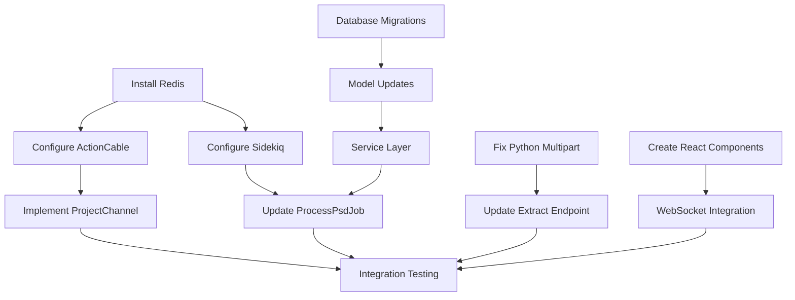

# PSD Processing Pipeline - Task Breakdown

## 1. Infrastructure Tasks (Day 1)

### 1.1 Install and Configure Redis
- [ ] Install Redis server
- [ ] Configure Redis for development environment
- [ ] Update docker-compose.yml to include Redis service
- [ ] Test Redis connection
**Time: 2 hours**

### 1.2 Configure Sidekiq
- [ ] Update config/application.rb to use Sidekiq adapter
- [ ] Create config/initializers/sidekiq.rb
- [ ] Add Sidekiq routes to config/routes.rb
- [ ] Test Sidekiq worker startup
**Time: 1 hour**

### 1.3 Configure ActionCable
- [ ] Update config/cable.yml for Redis
- [ ] Test WebSocket connection
- [ ] Configure CORS for WebSocket
**Time: 1 hour**

## 2. Backend Tasks - Rails (Day 2-3)

### 2.1 Database Updates
- [ ] Create migration: AddProcessingMetadataToProjects
- [ ] Create migration: AddMetadataToLayers  
- [ ] Create ProcessingLog model and migration
- [ ] Run migrations and update schema
**Time: 2 hours**

### 2.2 Model Updates
- [ ] Update Project model with processing methods
- [ ] Update Layer model with metadata fields
- [ ] Add validations and associations
- [ ] Create model tests
**Time: 2 hours**

### 2.3 Service Layer
- [ ] Fix PsdProcessingService multipart handling
- [ ] Create PsdProcessor service class
- [ ] Implement error handling and logging
- [ ] Add progress tracking methods
**Time: 4 hours**

### 2.4 Background Jobs
- [ ] Update ProcessPsdJob with new logic
- [ ] Create job tests
- [ ] Configure job retry logic
- [ ] Test job execution
**Time: 3 hours**

### 2.5 API Endpoints
- [ ] Add processing_status endpoint
- [ ] Add cancel_processing endpoint
- [ ] Add processing callback endpoint
- [ ] Update ProjectSerializer
**Time: 3 hours**

### 2.6 WebSocket Channels
- [ ] Implement ProjectChannel broadcasting
- [ ] Add authentication to channels
- [ ] Test real-time updates
**Time: 2 hours**

## 3. Python Service Tasks (Day 3)

### 3.1 Update Extract Layers Endpoint
- [ ] Fix multipart form parsing
- [ ] Add progress callback support
- [ ] Implement base64 image encoding
- [ ] Add error callback handling
**Time: 3 hours**

### 3.2 Optimize Layer Extraction
- [ ] Add memory management for large PSDs
- [ ] Implement concurrent layer processing
- [ ] Add timeout handling
**Time: 2 hours**

### 3.3 Add Metadata Extraction
- [ ] Extract layer bounds
- [ ] Extract opacity and blend modes
- [ ] Extract additional PSD metadata
**Time: 2 hours**

## 4. Frontend Tasks - React (Day 4)

### 4.1 Create ProcessingStatus Component
- [ ] Design component UI
- [ ] Implement progress bar
- [ ] Add status log display
- [ ] Style with Tailwind CSS
**Time: 3 hours**

### 4.2 WebSocket Integration
- [ ] Install @rails/actioncable
- [ ] Create useWebSocket hook
- [ ] Implement connection management
- [ ] Handle reconnection logic
**Time: 3 hours**

### 4.3 Update Existing Components
- [ ] Update FileUpload to show processing
- [ ] Update App.tsx to handle status updates
- [ ] Add error display components
- [ ] Update API client for new endpoints
**Time: 2 hours**

### 4.4 UI Polish
- [ ] Add loading animations
- [ ] Implement toast notifications
- [ ] Add cancel processing button
- [ ] Test responsive design
**Time: 2 hours**

## 5. Integration Tasks (Day 5)

### 5.1 End-to-End Testing
- [ ] Test complete upload flow
- [ ] Test concurrent uploads
- [ ] Test error scenarios
- [ ] Test progress updates
**Time: 3 hours**

### 5.2 Performance Testing
- [ ] Test with large PSD files (100MB+)
- [ ] Monitor memory usage
- [ ] Check for memory leaks
- [ ] Optimize bottlenecks
**Time: 2 hours**

### 5.3 Error Handling
- [ ] Test network failures
- [ ] Test Python service crashes
- [ ] Test invalid file uploads
- [ ] Verify error messages
**Time: 2 hours**

### 5.4 Documentation
- [ ] Update API documentation
- [ ] Create deployment guide
- [ ] Document configuration options
- [ ] Add troubleshooting guide
**Time: 1 hour**

## Task Dependencies

## Risk Factors

### High Risk
1. **Multipart form handling** - May require significant debugging
2. **WebSocket stability** - Connection drops could affect UX
3. **Memory usage** - Large PSDs could cause OOM errors

### Medium Risk
1. **Redis configuration** - Docker networking issues
2. **Progress accuracy** - Python callbacks may be delayed
3. **Error handling** - Edge cases in PSD format

### Low Risk
1. **Database migrations** - Well understood
2. **React components** - Straightforward implementation
3. **API endpoints** - Standard REST patterns

## Effort Summary

| Category | Tasks | Estimated Hours |
|----------|-------|-----------------|
| Infrastructure | 3 | 4 |
| Backend (Rails) | 16 | 17 |
| Python Service | 6 | 7 |
| Frontend | 11 | 10 |
| Integration | 9 | 8 |
| **Total** | **45** | **46 hours** |

## Recommended Task Order

1. **Day 1**: Infrastructure setup (Redis, Sidekiq, ActionCable)
2. **Day 2**: Rails backend (migrations, models, services)
3. **Day 3**: Python service updates + Rails jobs
4. **Day 4**: Frontend components and WebSocket
5. **Day 5**: Integration testing and polish

## Definition of Done

Each task is considered complete when:
- [ ] Code is written and working
- [ ] Unit tests pass
- [ ] Integration tests pass
- [ ] Code reviewed (if team)
- [ ] Documentation updated
- [ ] No console errors
- [ ] Performance acceptable